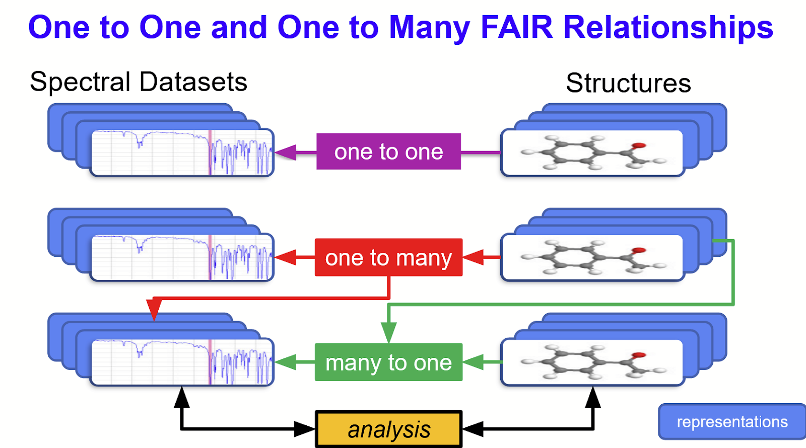

last updated 2021-11-30

# IUPAC-FAIRSpec

Welcome to the GitHub project for
[IUPAC Project 2019-031-1-024, Development of a Standard for FAIR Data Management for Spectroscopic Data](https://iupac.org/projects/project-details/?project_nr=2019-031-1-024). 

Our current working specification can be found at this site under [documentation/specifications](documents/specifications). 

A demonstration of IUPAC FAIRSpec finding aids and their application is at [https://chemapps.stolaf.edu/iupac/demo/demo.htm](https://chemapps.stolaf.edu/iupac/demo/demo.htm), with files at [https://chemapps.stolaf.edu/iupac/site/ifs](https://chemapps.stolaf.edu/iupac/site/ifs).

This GitHub project provides public copies of all presentations and publications of the IUPAC Project, as well as a reference Java implementation of the Standard as a Java library as well as a reference Java implementation of an "IUPAC FAIRSpec data and metadata extractor". This GitHub project is currently under intensely active development. It is *very preliminary* and, though public, is only meant for demonstration purposes. **Please do not implement these preliminary standards** as they are expected to change day by day throughout 2021. 

The principal goal of the project is to define standardized metadata associated with complex collections of spectroscopic data in the area of chemistry -- NMR, IR, Raman, MS, etc. The specification is modular and has been worked out primarily in the area of NMR spectroscopy at this time. 

It is the IUPAC FAIRSpec Finding Aid that, when [represented as JSON](https://chemapps.stolaf.edu/iupac/site/ifs/acs.joc.0c00770._IFS_findingaid.json) (in this case) or XML (leaving that for others for now), along with the extracted collection forms the basis of what we are calling "FAIR Data Management of Spectroscopic Data." 
 
If you just want to get an idea of what the "data extractor" does and not install anything yourself, see the demo at [St. Olaf College](https://chemapps.stolaf.edu/iupac/demo/demo.htm). It's still rather very crude, but it should give you an idea of what we are about. 

## Guiding Principles

The five principles that underlie development of the IUPAC FAIRSpec standard are given below.
<ul><li><b>1. FAIR Management of data should be an ongoing concern.</b>
<ul><li>A.	FAIR management of data must be an explicit part of research culture.
</li><li>B.	FAIR management of data should be of intrinsic value.
</li><li>C.	Good data management requires distributed curation.
</li><li>D.	Experimental work is by nature iterative.
</li></ul></li><li><b>2. Context is important.</b>
<ul><li>A.	Digital objects are generally part of a collection.
</li><li>B.	Chemical properties are related to chemical structure.
</li><li>C.	Data relationships are diverse and develop over time.
</li><li>D.	FAIR management of data should allow for validation.
</li></ul></li><li><b>3. FAIR management of data requires curation.</b>
<ul><li>A.	Data reuse relies upon practical findability.
</li><li>B.	Data has to be organized to be accessible.
</li><li>C.	Data interoperability requires well-designed metadata.
</li><li>D.	Value is in the eye of the reuser.
</li></ul></li><li><b>4. Metadata must be registered and standardized.</b>
<ul><li>A.	Register key metadata.
</li><li>B.	Assign a variety of persistent identifiers.
</li><li>C.	Enable metadata crosswalks.
</li><li>D.	Allow for value-added benefits.
</li></ul></li><li><b>5. FAIR data management standards should be modular, extensible, and flexible.</b>
<ul><li>A.	Modularity allows specialization.
</li><li>B.	Design to adapt to future needs.
</li><li>C.	Respect digital diversity.
</li><li>D.	All data formats should be valued.
</li></ul></li></ul> 

## Reference Implementation

The code here is an Eclipse Java project. If you want to clone it, feel free. Check it out. Run the test. Even suggest changes. Contribute. Since it is quite a preliminary project, don't get too frustrated if it doesn't work for you. It probably means I have forgotten to mention some aspsect of its implmeentation. Please contact Bob Hanson (hansonr@stolaf.edu) if you want some help. We'd like to hear from you.

The reference implementation consists of two main parts -- a Java library of mostly abstract classes that define the basics of the IUPAC FAIRSpec schema, and an imiplemenation of a "data and metadata extractor" that can produce IUPAC FAIRSpec Collections and their associated IUPAC FAIRSpec Finding Aids in JSON format.

The basic demo (src/com/integratedgraphics/ifs/ExtractorTest.java) takes a monolithic ZIP file (30-200MB) provided by authors as supporting information for manuscripts accepted by the Journal of Organic Chemistry and Organic Letters and extracts [Digital Objects](https://www.rd-alliance.org/system/files/DFT%20Core%20Terms-and%20model-v1-6.pdf) from it into a Digital Collection. As it does this, it creates in internal Java data model in the form of a an ISFSpecDataFindingAid. When it is done, it serializes this finding aid and writes it to a file. 

The Java test class is src/main/java/com/integratedgraphics/ifs/ExtractorTest.java. The extractor test reads one or more "extraction scripts" from /extract/ subdirectories and uses those to parse a Figshare zip file that was deposited by the American Chemical Society as part of their [FAIR Data initiative](https://pubs.acs.org/doi/10.1021/acs.orglett.0c00383). 

As it parses the extraction script, it:

<ol>
    <li>opens one or more Figshare ZIP files</li>
    <li>extracts Digital Objects into an "IFS FAIR Data Collection" in the site/ifs directory (not present here because of .gitignore)</li>
    <li>builds an IFSSpecDataFindingAid internal representation of the collection</li>
    <li>when done, generates a JSON serialization of the IFSSpecDataFindingAid object</li>
</ol>
    
Before you run the test, take a look at then test's main() method and adjust the parameters there a bit if you want. They include:

<ul>
    <li>first   the first test to run (0 to 12)</li>
    <li>last    the last test to run (0 to 12)</li>
    <li>targetDir  leave this as "../site/ifs"</li>
    <li>sourceDir  you can indicate a local source dir to use instead of Figshare to save download time. If you do that, you need to save the figshare nnnnnnnn.zip there.</li>
</ul>    
        
There are several other flags that can be set. The demo is not set up for batch command-line operation, and it is not built as a JAR file. It is simply an Eclipse Java project right now.

After you run the test, the /save/ifs directory will be populated, and the /html/demo.htm file should work. Since this HTML file is going to open files on your local machine, be sure to have your browser [set up for local file reading](http://wiki.jmol.org/index.php/Troubleshooting/Local_Files).
    
