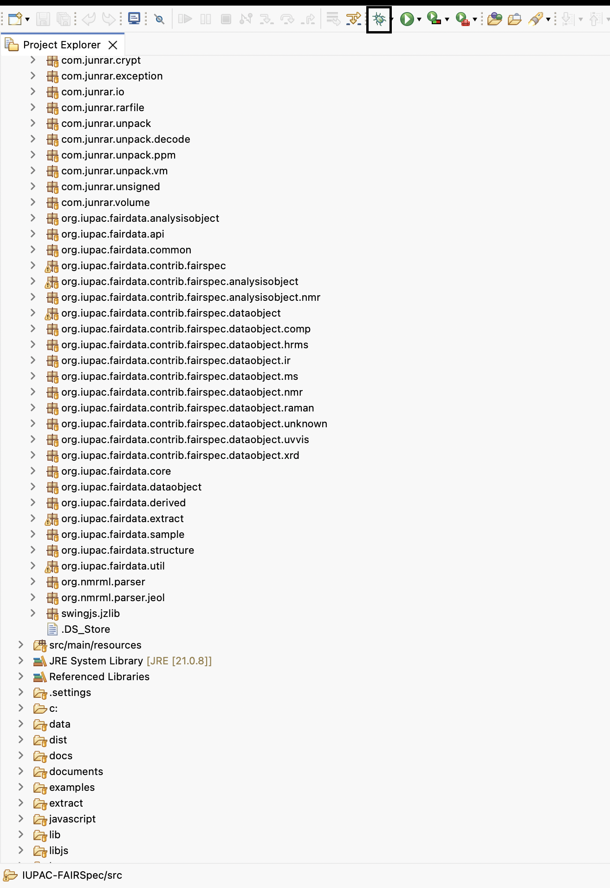
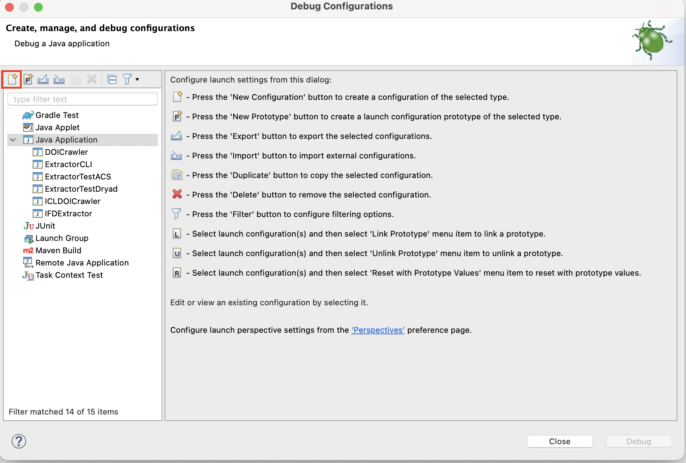
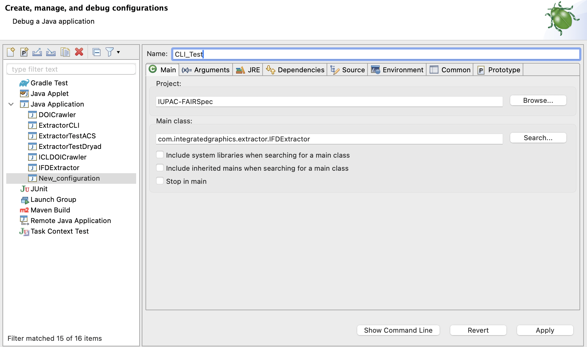
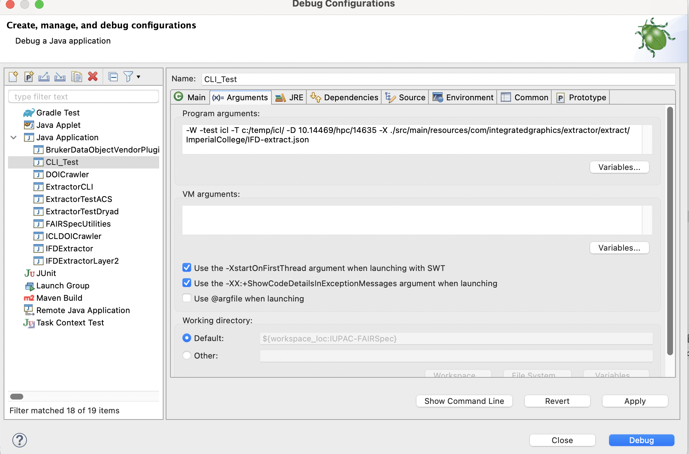

# COMMAND-LINE INTERFACE for IFD Extractor and Crawler

## CLI Flag Table (Last Updated: 01/29/2026)

| Required | Flag | Long Name | Argument (if available) | Description | Note |
| :--- | :---: | ---: | :--- | :---: | ---: |
|  | -h |help |  | |  | 
|  | -v | version |  |Get the current version of the FindingAidCreator |  | 
| [X] | -T | targetDir | <TARGET_DIR> | Target output directory for the finding aid | |
| [X] | -test | test | <SOURCE> | | dryad/icl/acs | 
| [X] | -D | doi | <DOI>| DOI/Identifier ||
|  | -a | assetOnly | | Asset Only ||
|  | -A | addPublicationMetadata | |Include ALL Crossref or DataCiteOnly for post-publication-related collections; in metadata. ||
|  | -c | noClean | |Don't empty the destination collection directory before extraction; allows additional files to be zipped ||
|  | -C | dataciteDonw | |Only for post-publication-related collections.||
|  | -debug | debug | | This will print out all debugging messages ||
|  | -E | embedPdf | | Loads PDF documents into finding aids for cross-domain viewing of spectra ||
|  | -F | findingAidOnly | | Only create a finding aid ||
|  | -g | noLandingPage | | Don't create a landing page ||
|  | -i | noIgnored | | Don't include ignored files -- treat them as REJECTED ||
|  | -I | requiredPubInfo | | Throw an error is datacite cannot be reached; post-publication-related collections only ||
|  | -l | noLaunch | | Don't launch the landing page ||
|  | -N | insitu | | Setting insitu true generates an entirely self-contained finding aid, without local files and any rezipping in the origin directory. ||
|  | -l | noLaunch | | Don't launch the landing page on browser when finished ||
|  | -O | readOnly | | Just create a log file ||
|  | -p | noPubInfo | | Ignore all publication info ||
|  | -P | extractSpecProperties | | Extract spectra properties ||
|  | -R | debugReadonly | | Readonly, no publication metadata ||
|  | -s | noStopOnFailure | | Continue if there is an error| |
|  | -S | localSource | <LOCAL_SOURCE_PATH> | Local Source Archive Path||
|  | -W | crawler | | Run the crawler | include -test icl|
|  | -Y | addIfdTypes | |Add IFD Types ||
|  | -x | noDownload | | Do not download files from the repository | For crawler only|
|  | -X | IFDExtractFile | | Input IFD-extract.json configuration file, if used | |
|  | -z | noZip | | Don't zip up the target directory ||
|  | -schema | schema | | Validate the generated finding aid (only working with the terminal) ||

## Requirement:

- Java version: **>= Java 8**

## Use the Debug Interface in Eclipse

1. Use the **debug tool** in Eclipse:



2. Create a new test



3. Set the configuration for the test 



4. Argument choices:

- Show the manual:


The console displays:


- Dryad: 

`-test dryad -debug -T c:/temp/dryad/ -S c:/temp/dryad/mcvdnckbb/dataset.zip -D mcvdnckbb`

- ACS: 

`-test acs -debug -T c:/temp/acs/ -D acs.orglett.0c00874`

Don't need to include the local source since the extractor will fetch the data from online sources.

- ICL: 

`-W -test icl -debug -T c:/temp/icl/ -o 10.14469/hpc/1463 X ./src/main/resources/com/integratedgraphics/extractor/extract/ImperialCollege/IFD-extract.json`



This will generate two folders 


## Run from terminal (MacOS)

> **Note**
> Everytime the developer runs the extractor/crawler in Eclipse and want to use terminal, they need to create a new bin that only contains the Java class files:
> ```
> rm -rf bin
> javac -d bin -target 1.8 -source 1.8 -cp "lib/*" src/**/*.java
> ```
> When they switch back to Eclipse, run this on the terminal at `.IUPAC-FAIRSPEC` folder
>```
> rm -rf bin
> javac -d bin -target 1.8 -source 1.8 -cp "lib/*" src/**/*.java
> # By using the trailing slash (src/main/resources/), rsync copies the contents (packages/files) directly into bin, effectively merging them.
> # Only run this when generating /bin folder to run in eclipse
> rsync -av --exclude="*.java" src/main/resources/ bin/
> ```

### Create the IFDExtractor.jar file (for first time using terminal)

- Create `bin` folder in `IUPAC-FAIRSpec` by running this on the terminal

```
rm -rf bin
# Compile all the .java files
javac -d bin -target 1.8 -source 1.8 -cp "lib/*" src/**/*.java
# Don't include the resource files in bin/
```

- Create a `manifest.txt` file in the `./IUPAC-FAIRSPEC/dist/` folder as below (always have a new line at the end):

```
Main-Class: com.integratedgraphics.extractor.IFDExtractor
Class-Path: ../bin/ ../lib/commons-compress-1.22.jar ../lib/commons-io-2.11.0.jar ../lib/CDK-SwingJS.jar ../lib/JmolDataD.jar ../src/main/resources/

```

- Generate a `IFDExtractor.jar` file in `dist` folder:

```
jar cvfm dist/IFDExtractor.jar dist/manifest.txt -C bin .
```

- You can run the script `cli_generating_jar_terminal.sh` (works for both Windows and macOS) to automate this process.


### Run the `IFDExtractor.jar` on terminal:

- Direct to `.IUPAC-FAIRSPEC` folder

- Get the version: `java -jar dist/IFDExtractor.jar -v`

- Get the manual: `java -jar dist/IFDExtractor.jar -v`

- Run the extractor on a Dryad dataset: `java -jar dist/IFDExtractor.jar -test dryad -T c:/temp/dryad/ -S c:/temp/dryad/f7m0cfz7t/dataset.zip -D f7m0cfz7t -debug -l` or `java -jar dist/IFDExtractor.jar -test dryad -T c:/temp/dryad/ -S c:/temp/dryad/mcvdnckbb/dataset.zip -D mcvdnckbb`

- Run the extractor on an ACS dataset: `java -jar dist/IFDExtractor.jar -test acs -T c:/temp/acs/ -D acs.joc.0c00770`

- Run the crawler on an ICL dataset: `java -jar dist/IFDExtractor.jar -W -test icl -T c:/temp/icl/ -D 10.14469/hpc/14635 -X src/main/resources/com/integratedgraphics/extractor/extract/ImperialCollege/IFD-extract.json`

- Automatically validate the finding aid after generating with `-schema` flag: `java -jar dist/IFDExtractor.jar -test acs -T c:/temp/acs/ -D acs.joc.0c00770 -schema` 

> **Note:**
> You must install the library `check-jsonschema` via `pip` (Python) to use this flag
>```
>pip install check-jsonschema
>```