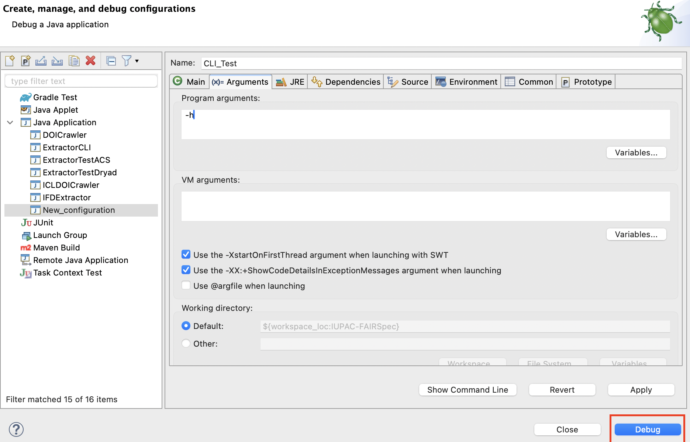
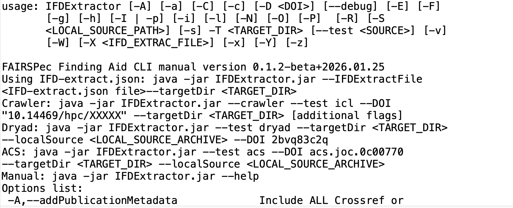
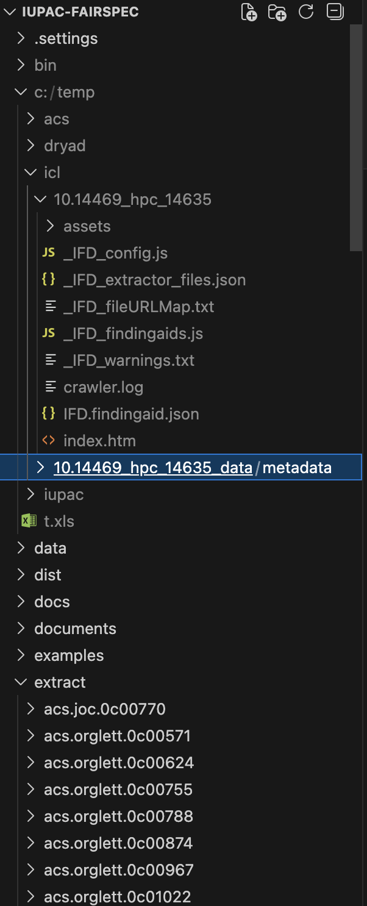

# Dryad's Fetching Python Script

## Set Up 

1. Clone the repository from [GitHub Link](https://github.com/FayNguyen03/dryad_script.git)

2. Sign up for a Dryad API account by following this [Dryad API Accounts Instruction](https://github.com/datadryad/dryad-app/blob/main/documentation/apis/api_accounts.md)

3. Install Python3 and import the necessary Python modules:

`pip install requests dotenv`

4. Create a `.env` file in the same directory with the Python script following this:

```
CLIENT_ID={YOUR_DRYAD_CLIENT_ID}
CLIENT_SECRET={YOUR_DRYAD_CLIENT_SECRET}
PARENT_DIRECTORY={YOUR_LOCAL_DIRECTORY_TO_STORE_DOWLOAD_FILE_INCLUDING_SLASH_AT_THE_END} (Relative Path)
```

## Fetch Dryad dataset

1. Open terminal and change directory to get to the folder that contains the script

2. To get a or multiple dataset(s) with specific `doi:10561/dryad.XXXXXX`, run the script in the terminal:

`python3 Dryad.py XXXXX1 XXXXXX2`

3. The script will fetch the data and create a `dataset.zip` file at the local directory that you want to store the downloaded file.

# CLI

## CLI Flag Table (Updating)

| Required | Flag | Long Name | Argument (if available) | Description | Note |
| :--- | :---: | ---: | :--- | :---: | ---: |
|  | -h |help |  | |  | 
|  | -v | version |  |Get the current version of the FindingAidCreator |  | 
| [X] | -T | targetDir | <TARGET_DIR> | Target output directory for the finding aid | |
| [X] | -test | test | <SOURCE> | | dryad/icl/acs | 
| [X] | -D | doi | <DOI>| DOI/Identifier ||
|  | -a | assetOnly | | Asset Only ||
|  | -A | addPublicationMetadata | |Include ALL Crossref or DataCiteOnly for post-publication-related collections; in metadata. ||
|  | -c | noClean | |Don't empty the destination collection directory before extraction; allows additional files to be zipped ||
|  | -C | dataciteDonw | |Only for post-publication-related collections.||
|  | -debug | debugging | | This will print out all debugging messages ||
|  | -E | embedPdf | | Loads PDF documents into finding aids for cross-domain viewing of spectra ||
|  | -F | findingAidOnly | | Only create a finding aid ||
|  | -g | noLandingPage | | Don't create a landing page ||
|  | -i | noIgnored | | Don't include ignored files -- treat them as REJECTED ||
|  | -I | requiredPubInfo | | Throw an error is datacite cannot be reached; post-publication-related collections only ||
|  | -l | noLaunch | | Don't launch the landing page ||
|  | -N | insitu | | Setting insitu true generates an entirely self-contained finding aid, without local files and any rezipping in the origin directory. ||
|  | -l | noLaunch | | Don't launch the landing page on browser when finished ||
|  | -O | readOnly | | Just create a log file ||
|  | -p | noPubInfo | | Ignore all publication info ||
|  | -P | extractSpecProperties | | Extract spectra properties ||
|  | -R | debugReadonly | | Readonly, no publication metadata ||
|  | -s | noStopOnFailure | | Continue if there is an error| |
|  | -S | localSource | <LOCAL_SOURCE_PATH> | Local Source Archive Path||
|  | -W | crawler | | Run the crawler | include -test icl|
|  | -Y | addIfdTypes | |Add IFD Types ||
|  | -x | noDownload | | Do not download files from the repository | For crawler only|
|  | -X | IFDExtractFile | | Input IFD-extract.json configuration file, if used | |
|  | -z | noZip | | Don't zip up the target directory ||

## Use the Debug Interface

1. Use the **debug tool** in Eclipse:


2. Create a new test


3. Set the configuration for the test 


4. Argument choices:

- Show the manual:



The console displays:



- Dryad: 

`-test dryad -debug -T c:/temp/dryad/ -S c:/temp/dryad/mcvdnckbb/dataset.zip -D mcvdnckbb`

- ACS: 

`-test acs -debug -T c:/temp/acs/ -D acs.orglett.0c00874`

Don't need to include the local source since the extractor will fetch the data from online sources.

- ICL: 

`-W -test icl -debug -T c:/temp/icl/ -o 10.14469/hpc/1463 X ./src/main/resources/com/integratedgraphics/extractor/extract/ImperialCollege/IFD-extract.json`


This will generate two folders 

